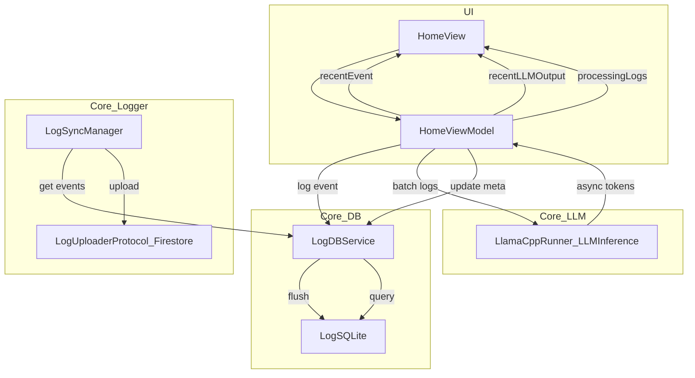

## Architecture Overview

The EventProcessor app is structured as a small, layered macOS application:

- **App layer** (`AppDelegate`, `AppCoordinator`, `RootView`, `DependencyContainer`): bootstraps the app, wires dependencies, and presents SwiftUI views.
- **Feature layer** (`HomeView`, `HomeViewModel`): user-facing UI and presentation logic.
- **Core layer**:
  - **Config** (`SystemConstants`, `LLMConstants`): central constants.
  - **DB** (`LogDBProtocol`, `LogSQLite`, `LogDBService`, `LogEntry`, `LogMinEntry`): local persistence and in-memory buffering.
  - **Logger / Sync** (`LogSyncManager`, `LogUploaderProtocol`, `FirestoreManager`): periodic upload of aggregated logs to a remote backend.
  - **LLM Inference** (`LLMInferenceProtocol`, `LlamaCppRunner`): encapsulates llama.cpp model lifecycle and token generation.

This separation keeps UI, persistence, logging/sync, and LLM concerns decoupled behind protocols.

---

## Architecture Decisions

### 1. Layered “Core + Feature + App” structure

- **Decision**: Keep domain/persistence/LLM logic in `Core`, UI and presentation in `Features`, and startup/wiring in `App`.
- **Why**:
  - Makes it easier to **test** core logic (e.g. `HomeViewModel`, `LogDBService`, `LogSyncManager`, `LlamaCppRunner`) without going through the UI.
  - Allows swapping implementations behind protocols (`LogDBProtocol`, `LogUploaderProtocol`, `LLMInferenceProtocol`) for mocks or future backends.

### 2. In-memory aggregation + periodic flush for logs

- **Decision**: `HomeViewModel` emits high-frequency `LogEntry`s, while `LogDBService` groups them in memory (`[TimeInterval: LogMinEntry]`) and flushes to SQLite periodically.
- **Why**:
  - Reduces I/O pressure vs writing every second.
  - Keeps the UI responsive because writes happen off the main thread, and aggregation logic is isolated in `LogDBService`.
  - `LogMinEntry` gives a natural “per-minute” rollup that is cheaper to sync and query.

### 3. Async LLM abstraction through `LLMInferenceProtocol`

- **Decision**: All llama.cpp interaction is hidden behind `LLMInferenceProtocol`, implemented by `LlamaCppRunner`.
- **Why**:
  - Keeps llama-specific C APIs isolated in one place.
  - Lets `HomeViewModel` depend only on a high-level, async streaming API (`AsyncThrowingStream<String, Error>`), making it easier to mock in tests.
  - Enables future replacement of the LLM backend without touching the UI or most of the domain layer.

### 4. Retry logic at the view-model level

- **Decision**: `HomeViewModel.process(_:)` owns simple bounded retry logic for LLM calls.
- **Why**:
  - Keeps resilience policy close to where results are consumed and surfaced to the user.
  - Avoids complicating lower-level components (`LlamaCppRunner`) with UI-specific retry semantics.

---

## Threading Model

### UI and Combine

- **UI updates** (e.g. `resentEvent`, `resentLLMOutput`, `processingLogs`) are always received and mutated on the **main thread**:
  - `HomeViewModel.startService()` uses `Timer.publish` and ensures the UI sink uses `.receive(on: DispatchQueue.main)`.
- `HomeView` observes `HomeViewModel` via `@ObservedObject`, so `@Published` property changes drive SwiftUI updates on the main thread.

### Logging and DB access

- `LogDBService` uses a dedicated **concurrent `DispatchQueue`** with `.barrier` blocks for mutating shared state:
  - In-memory `buffer` and `metaStringBuffer` are only written under barrier blocks to avoid data races.
- Flushing to the DB:
  - Periodic flush is scheduled via a **`DispatchSourceTimer`** on a background queue (`.background` QoS).
  - Actual DB operations (`addEvents`, `update(metadataWith:)`) run in a **detached `Task` with `.utility` priority**, isolating I/O from the main thread.
- On app termination, `forceFlushSync` uses `DispatchSemaphore` to **block briefly** until a final async write finishes, minimizing data loss while still avoiding long stalls.

### LLM Inference

- LLM work is always off the main thread:
  - `HomeViewModel.loadLLMModel()` kicks off `Task.detached` to load the model.
  - `HomeViewModel.processBatch(_:)` spawns a `Task(priority: .background)` to run `process(_:)` and then update meta strings in the DB.
- Inside `LlamaCppRunner`:
  - Long-running llama.cpp operations (`tokenizeAndPrefill`, `generationLoop`) happen on background tasks that drive an `AsyncThrowingStream<String, Error>`.
  - Tokens are streamed back incrementally to the caller while internal llama buffers are cleared and reused.

### Sync Manager

- `LogSyncManager` uses a **`Timer`** with a fixed interval to call `sync()` periodically.
- `sync()` itself is `async` and uses an `isSyncing` flag to prevent overlapping runs.
- Fetching from `LogDBProtocol` and pushing to `LogUploaderProtocol` runs off the main thread (DB and uploader implementations are expected to be async/I/O bound).

---

## Data Flow Diagram

### High-level data flow



### Narrative summary

1. **Event generation**: `HomeViewModel` uses a `Timer.publish` pipeline to generate a random `LogEntry` every second and emit it to the UI (`resentEvent`) while also passing it to `LogDBService.log(value:)` for in-memory aggregation.
2. **Persistence**: At a configured interval, `LogDBService` flushes aggregated `LogMinEntry` batches to `LogSQLite`, which writes to the on-disk SQLite database.
3. **LLM processing**: Every N seconds (batch window), a collected set of `LogEntry`s is sampled and passed to `HomeViewModel.process(_:)`, which calls into `LLMInferenceProtocol` (`LlamaCppRunner`) to generate a short text. The result is:
   - Published to the UI as `resentLLMOutput`.
   - Saved back as `metaString` for the corresponding minute via `LogDBService.update(metaString:for:)`.
4. **Sync**: Independently, `LogSyncManager` periodically queries the DB for new `LogMinEntry`s in a time range and, if any exist, uploads them via `LogUploaderProtocol` to a remote backend (e.g. Firestore).
5. **UI**: `HomeView` simply observes `HomeViewModel` and renders:
   - The latest numeric event and timestamp.
   - The latest LLM-generated description.
   - A status indicator driven by `processingLogs`.

This architecture keeps the UI thin, isolates I/O and LLM work off the main thread, and routes all event and metadata flows through well-defined core services.

---

## File Structure (high level)

```text
EventProcessor/
├─ EventProcessor/
│  ├─ App/
│  │  ├─ AppDelegate.swift
│  │  ├─ AppCoordinator.swift
│  │  ├─ RootView.swift
│  │  └─ DependencyContainer.swift
│  ├─ Core/
│  │  ├─ Config/
│  │  │  └─ SystemConstants.swift
│  │  ├─ DB/
│  │  │  └─ Logs/
│  │  │     ├─ LogDBProtocol.swift
│  │  │     ├─ LogSQLiteDB.swift
│  │  │     ├─ LogDBService.swift
│  │  │     └─ LogModel.swift
│  │  ├─ Logger/
│  │  │  ├─ LogSyncManager.swift
│  │  │  └─ LogUploaderProtocol.swift
│  │  └─ LLMInference/
│  │     ├─ LLMInferenceProtocol.swift
│  │     ├─ LLMConstants.swift
│  │     └─ LlamaCppRunner.swift
│  ├─ Features/
│  │  └─ HomeView/
│  │     ├─ HomeView.swift
│  │     └─ HomeViewModel.swift
│  ├─ Resources/
│  │  └─ GoogleService-Info.plist
│  └─ Tests/
│     ├─ EventProcessor_Tests.swift
│     └─ LogDBServiceTests.swift
├─ Tuist/
│  └─ Package.swift
├─ .github/
│  └─ workflows/
│     └─ ci.yml
├─ Project.swift
├─ README.md
├─ Architecture.md
├─ TestCase.md
└─ Security.md
```

